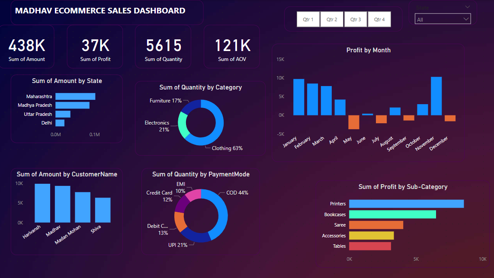

# PowerBI E-Commerce Sales Insights Dashboard

## 📌 Overview
This project presents an interactive **E-Commerce Sales Dashboard** built using **Power BI**. It provides insightful visualizations on key sales metrics such as total revenue, profit, quantity sold, and average order value (AOV). The dashboard enables businesses to analyze sales trends, customer behavior, and product performance.

## 📊 Features
- **Sales Analysis**: Tracks revenue, profit, and quantity sold.
- **State-wise Sales Breakdown**: Highlights top-performing states.
- **Category & Sub-category Insights**: Identifies best-selling product categories.
- **Payment Mode Distribution**: Shows preferred customer payment methods.
- **Monthly Profit Trends**: Analyzes seasonal sales performance.
- **Customer Analysis**: Recognizes top customers by purchase amount.
- **Quarterly Filtering**: Provides flexibility to view sales performance per quarter.

## 📷 Dashboard Preview

## 🛠 Tools Used
- **Power BI**: Data visualization and dashboard creation.
- **Excel/CSV**: Data source for sales records.
- **DAX (Data Analysis Expressions)**: Used for calculations and data modeling.

## 📌 How to Use
1. Open the `.pbix` file in Power BI.
2. Connect to your dataset (Excel, SQL, or CSV).
3. Explore the interactive visualizations.
4. Use filters to analyze quarterly or state-wise data.

## 🔥 Key Insights
- **Clothing** dominates the sales quantity with **63% share**.
- **Printers** generate the highest profit among sub-categories.
- **May & June** show negative profits, indicating potential operational challenges.
- **Maharashtra** leads in total sales, followed by **Madhya Pradesh**.
- **Cash on Delivery (COD)** is the most used payment method (44%).

## 📂 Project Structure
